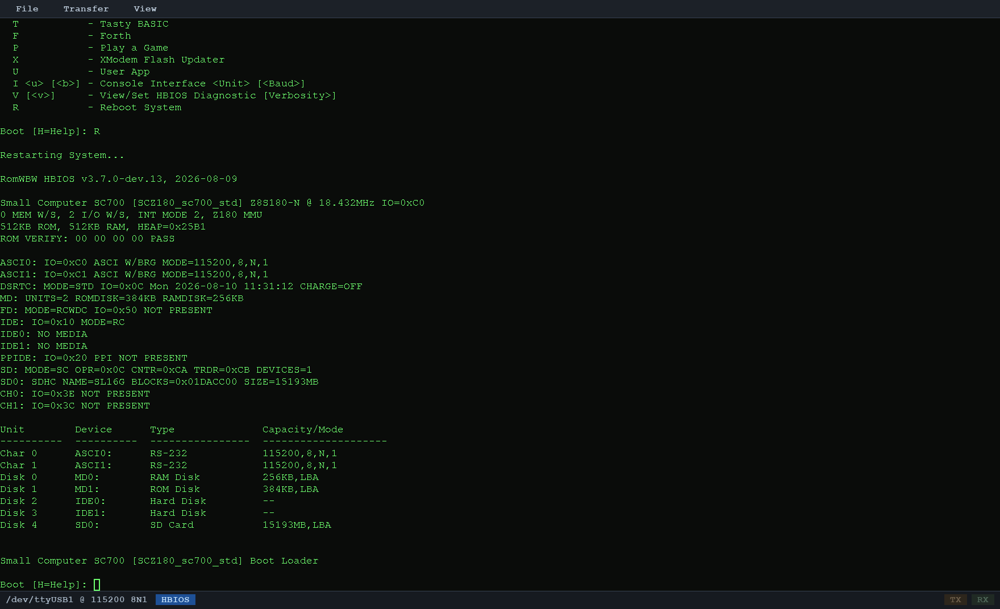
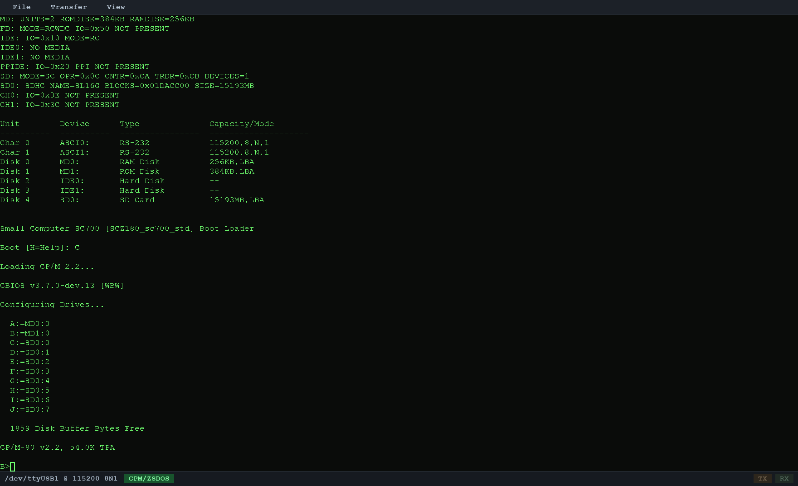
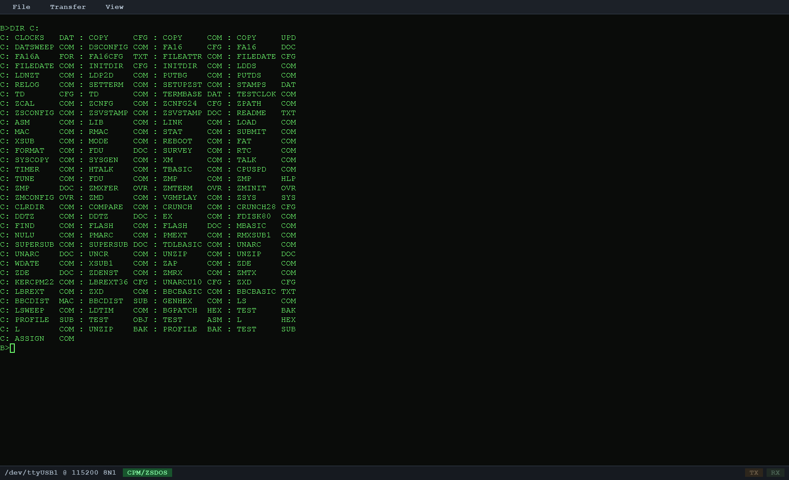
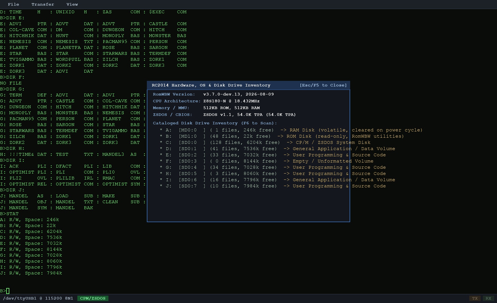
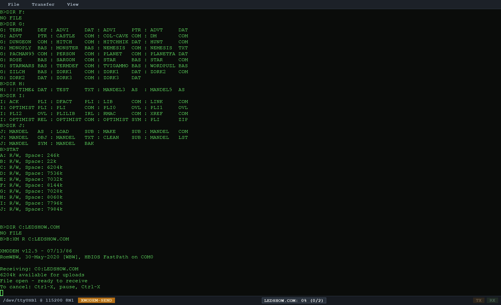
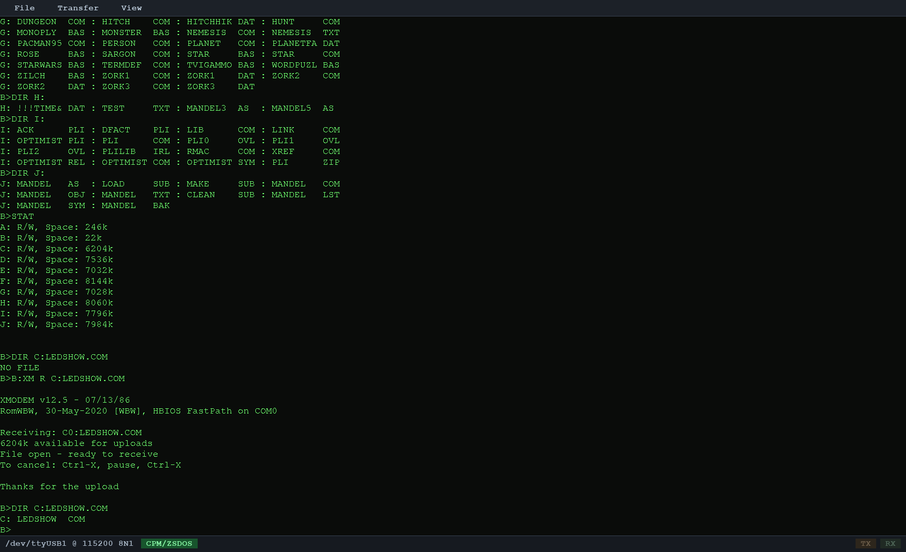
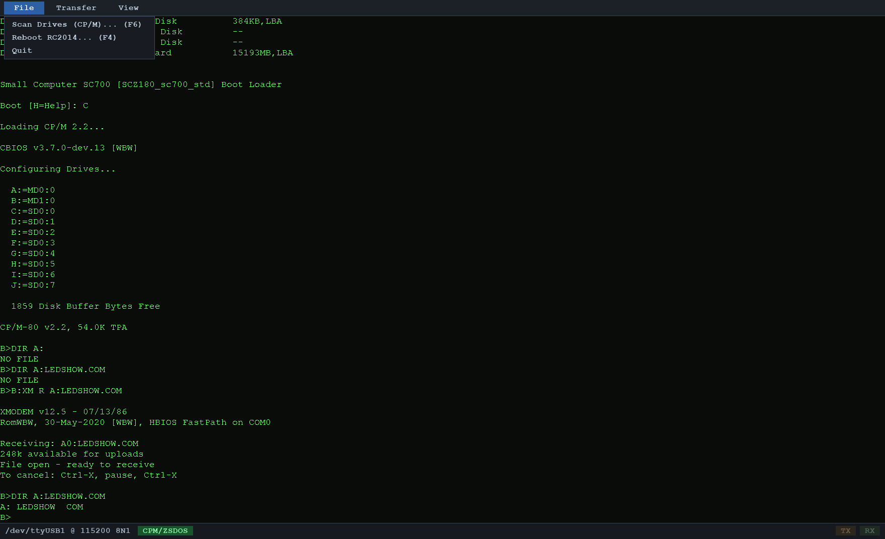
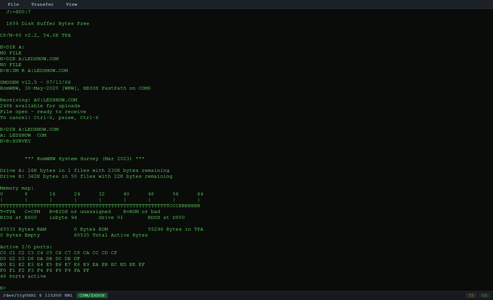

# rc2014bridge

A serial bridge for an RC2014/RomWBW retro computer: a pygame terminal
for a human, an MCP server for a model, both driving the same serial
console **concurrently** — no trading exclusive access, no relaying text
back and forth by hand.

Built for an RC2014 Pro running RomWBW, but the serial/XMODEM layer isn't
board-specific. See [`ROADMAP.md`](ROADMAP.md) for the design history and
what's planned next (an on-device agent, and possibly custom RCBus
hardware).

## What it does

- **Owns the serial port permanently** (replaces minicom), feeding incoming
  bytes into an embedded [`pyte`](https://github.com/selectel/pyte)
  terminal emulator that tracks real screen state — a character grid and
  cursor position, not a raw byte blob.
- **Renders that screen in a pygame window** and forwards local keystrokes to
  the port, same as any terminal program. Human typing is never gated on the
  agent's operation lock — except during an XMODEM transfer, where ordinary
  keys are held back (Ctrl-C and Ctrl-X always pass, so you can always
  cancel one).
- **Exposes an MCP server alongside the GUI**, so a model can drive the exact
  same session a human is watching — see [The MCP server](#the-mcp-server)
  and its [tool table](#tools) (run commands, transfer files, scan drives,
  survey hardware, reboot, and more).
- **XMODEM send *and* receive**, implemented from scratch — not a wrapper
  around `sx`/minicom — because getting real file transfer working
  against actual RomWBW hardware surfaced quirks a generic wrapper
  wouldn't (see [Real hardware bugs found building this](#real-hardware-bugs-found-building-this)).
- **Hardware & Disk Info modal** (F5): captured RomWBW/CPU/memory config plus
  a live drive catalogue from `rc2014_scan_drives`/`SURVEY`.
- **Reboot** (F4), picking the right method for whatever state the machine
  is currently in — CP/M, HBIOS, or the flash utility.
- **Mandel Pixel-Stream rendering** (F7): auto-detects and decodes the
  [Mandel Pixel-Stream protocol](protocol/DESIGN.md) on the wire, drawing
  RGB output live as it streams in, with a standalone popup window per render.
- **Connection Settings screen** (F8): pick the serial port from a
  live-scanned dropdown, choose a baud rate and RTS/CTS, test a combination
  before committing, and reconnect live without restarting — see
  [Connection settings](#connection-settings).
- **Automatic baud handling**: follows the board's own HBIOS `i 0 <baud>`
  speed changes live, and falls back to the configured default baud if the
  board resets mid-session and starts producing line noise instead — also in
  [Connection settings](#connection-settings).
- **Config file** (`rc2014bridge.ini`), so the long list of CLI flags only
  has to be set once — see [Config file](#config-file).
- **RTS/CTS hardware flow control**: the UART handles write backpressure
  itself, so manual pacing tuning is no longer the primary path — see
  [Serial pacing](#serial-pacing).

## Screenshots

All captured against a real Small Computer SC700 (`SCZ180_sc700_std`, Z8S180
@ 18.432MHz) over its serial port — not a simulator.

**Boot menu and CP/M boot sequence**, driven via `rc2014_reboot`: the RomWBW
HBIOS banner, device inventory, and boot loader, then RomWBW loading CP/M and
configuring drives.




**`rc2014_run_command`** sending `DIR C:` and returning the real directory
listing:



**Hardware & Disk Info modal** (F5), populated from a live `rc2014_scan_drives`
catalogue — real drive contents, including a Zork/adventure-game collection
and a Mandelbrot project living on this board's SD card:



**XMODEM upload** via `rc2014_upload`: the status bar's progress meter mid-transfer,
then the board's own "Thanks for the upload" and a `DIR` confirming the file
landed:




**The GUI's File menu**, for the human side of the bridge:



**`rc2014_survey`** — memory map, BIOS/BDOS addresses, and active I/O ports in
one call:



## Quick start

If you're comfortable with Python, this is the whole thing:

```
python3 -m venv .venv
.venv/bin/pip install -r requirements.txt
.venv/bin/python -m rc2014bridge.app --port /dev/ttyUSB0
```

A window opens showing the console. Type into it like any terminal. The
MCP server starts with it, on port 8014. If that worked, skip to
["The MCP server"](#the-mcp-server) below.

### Installing and running, step by step

New to running Python projects from source? Here's the same thing in more
detail.

**1. Install Python.** You need Python 3.10 or newer.

- Check what you have: `python3 --version`
- Linux: usually already installed; if not, use your distro's package
  manager (`sudo apt install python3 python3-venv` on Debian/Ubuntu).
- macOS: `brew install python3`, or the installer from
  [python.org](https://www.python.org/downloads/).
- Windows: the installer from [python.org](https://www.python.org/downloads/)
  — tick "Add python.exe to PATH" during install. Use `py` instead of
  `python3` in the commands below.

**2. Get the code.** Either `git clone` this repository, or download it as
a ZIP from GitHub (the green "Code" button) and unzip it. Open a terminal
in that folder — everything below is run from there.

**3. Create a virtual environment.** This keeps this project's Python
packages separate from anything else on your machine, in a folder called
`.venv`:

```
python3 -m venv .venv
```

**4. Install the project's dependencies into it:**

```
.venv/bin/pip install -r requirements.txt
```

(Windows: `.venv\Scripts\pip install -r requirements.txt`)

This installs `pygame` (the terminal window), `pyserial` (talks to the
board over USB), `pyte` (the terminal emulator), and the MCP server
libraries. No system-wide install, nothing touches files outside `.venv`.

**5. Find your serial port.** Plug in the USB-to-serial adapter, then:

- Linux: `ls /dev/ttyUSB*` or `ls /dev/ttyACM*` — usually `/dev/ttyUSB0`.
  If the port doesn't show up or you get a "Permission denied" error
  running the app, your user probably isn't in the `dialout` group yet:
  `sudo usermod -aG dialout $USER`, then log out and back in (a full
  re-login, not just a new terminal).
- macOS: `ls /dev/tty.usbserial*` or `ls /dev/tty.usbmodem*`.
- Windows: check Device Manager under "Ports (COM & LPT)" — it'll be
  something like `COM3`.

**6. Run it**, using the port you found:

```
.venv/bin/python -m rc2014bridge.app --port /dev/ttyUSB0
```

(Windows: `.venv\Scripts\python -m rc2014bridge.app --port COM3`)

A window should open showing a blank terminal. Power on or reboot the
board and you should see it boot. Click into the window and type — it
goes straight to the board, just like a terminal program. `Ctrl-C` in the
window does nothing special (it goes to the board); to quit the app, use
the **File > Quit** menu or close the window.

**Nothing shows up on the screen?** Wrong baud rate or the board isn't
actually booting — check with `--baud` (default `115200`) and make sure
the board is powered, or open **Settings > Connection Settings...** (F8)
in the running app to try another rate without restarting. **Window
doesn't open at all?** This is a GUI app, so it needs a desktop to open a
window in — it won't work over a plain SSH session without X forwarding
(`ssh -X`), and won't work in a container with no display. Read the error
in the terminal you ran the command from; it'll say if that's the problem.

## Connection settings

**In the app:** **Settings > Connection Settings...** (F8) opens a screen
with a dropdown of detected serial ports, a dropdown of common baud rates
(1200 – 230400), and an RTS/CTS checkbox. **Test Connection** opens the
chosen port/baud/rtscts combination and closes it again without touching
the live connection, so you can sanity-check a setting before committing to
it. **Apply & Reconnect** closes the current port and reopens it with the
new settings (the XMODEM/drive-scan lock keeps this from firing mid-transfer)
and writes the change back to the config file so a restart picks up the
same settings automatically.

**On the command line / in a config file:** `--port`, `--baud`, `--rtscts`.

**Automatic:** if you run HBIOS's boot loader `i 0 <baud>` command (e.g.
`i 0 230400` at the `Boot [H=Help]:` prompt) to change the console SIO's own
speed, the bridge notices the echoed command and its "Change speed now..."
confirmation and reconfigures its end to match automatically - no need to
open the Settings screen yourself. This only follows unit 0 (the console
port the bridge is actually wired to); an `i 1 ...` for the other SIO is
left alone. It's a live-session follow, not persisted to the config file -
that command is a boot-loader runtime override, not necessarily what the
board comes up at after a power cycle, so the saved default stays under
your explicit control via Apply & Reconnect.

That follow is easy to strand: reset the board (reset button, `REBOOT`, a
crashed program) while the bridge is still on the followed rate, and the
board comes back up at its power-on default with nothing recognizable to
match against - just line noise at the bridge's now-wrong rate. The bridge
watches for that too: a sustained run of mostly-unreadable bytes at
anything other than the board's resting baud (`--baud`/the config file's
value, not wherever a HBIOS follow last left it) falls back to that resting
rate automatically. It only ever tries that one rate once conditions look
like noise again - not a hunt through every possible baud - so if the board
is doing something else entirely, use Connection Settings to sort it out
by hand.

## Config file

Every flag below can also be set once in an INI file instead of retyped on
every launch. By default the app looks for `rc2014bridge.ini` in the
current directory (override with `--config path/to/file.ini`); a missing
file just means the built-in defaults apply. A flag given on the command
line always overrides the config file.

```ini
[serial]
port = /dev/ttyUSB0
baud = 115200
rtscts = false

[display]
cols = 160
rows = 48

[files]
log-file = rc2014bridge.log
hw-info = hardware_info.json

[mcp]
enabled = true
host = 0.0.0.0
port = 8014

[pacing]
xmodem-pacing =
text-pacing =

[logging]
verbose = false
```

Section names are just for readability — every key is looked up by name
regardless of which section it's under. The Settings screen's **Apply &
Reconnect** writes `port`/`baud`/`rtscts` back into this file (creating it
under `[serial]` if it doesn't exist yet) so the picked connection survives
a restart; everything else here is only ever read, not written by the app.

## The MCP server

The bridge serves MCP over **stateless streamable HTTP at `/mcp`** (protocol
2026-07-28 and later), from `0.0.0.0:8014` by default. Every request is
self-contained - no `initialize` handshake, no session id, no persistent
connection - so there's no separate SSE transport to connect to either. Any
MCP client on your network can connect.

```json
{
  "mcpServers": {
    "rc2014bridge": {
      "type": "http",
      "url": "http://192.168.1.50:8014/mcp"
    }
  }
}
```

Claude Code: `claude mcp add --transport http rc2014bridge http://192.168.1.50:8014/mcp`

Flags: `--mcp-host`, `--mcp-port`, `--no-mcp`.

## Serial pacing

Writes are paced so a slow UART can keep up. The defaults (`8:10` for XMODEM,
`1:15` for typing — chunk bytes : gap in ms) were derived on a 7.4MHz Z80 behind
an external SIO and are safe everywhere, but they run a 115200 line at a small
fraction of its rate.

**RTS/CTS is now the recommended fix** (`--rtscts`, or set it from the
Connection Settings screen) — the UART itself throttles writes, so manual
pacing tuning is no longer the primary path on boards that wire it up.
`link.calibrate_pacing()` (finds what a board accepts without RTS/CTS,
accepting a setting only when a file survives a round trip byte-for-byte, and
records it in `hardware_info` for later runs) still exists for that case, but
isn't exposed as an MCP tool. Measured on an SC700 (Z180 @ 18.432MHz) before
RTS/CTS was wired up: `32:5` passed, `64:5` failed, and a 64KB upload went from
111s to 59s. Override by hand with `--xmodem-pacing 32:5` / `--text-pacing 8:5`.

Note where the time actually goes: pacing is only part of it. Most of the cost is
per-block turnaround — the board writing a block and ACKing it — so the biggest
remaining lever is fewer, larger blocks (1K/STX) rather than tighter pacing. The
sender currently uses 128-byte blocks only.

### Tools

The surface is built so that **one call is one completed operation** — no
send-then-poll loop.

| Tool | Purpose |
|---|---|
| `rc2014_run_command` | **The main one.** Sends a command, waits for the prompt to return, gives back just that command's output. |
| `rc2014_get_screen` | Screen contents with a state header. Defaults to the last 40 lines; `max_lines=0` for all scrollback. |
| `rc2014_send_text` | Raw text, no waiting. For interactive programs, the boot menu, answering a prompt. |
| `rc2014_send_keys` | Control characters, nothing appended — `^C`, `^X<PAUSE>^X`, `<ESC>`. The only tool allowed to run mid-operation, because interrupting one is the point. |
| `rc2014_wait_for` | Wait for a regex in output arriving *from now on*. |
| `rc2014_wait_until_ready` | Wait for a boot to finish and the prompt to settle. Call after booting a disk — a boot profile keeps running programs, and commands sent during that window are lost. |
| `rc2014_upload` | Host file → board. Runs XM, transfers, verifies with `DIR`. |
| `rc2014_download` | Board file → host, with sha256. |
| `rc2014_read_text_file` | Read text via `TYPE` — no transfer needed. |
| `rc2014_write_text_file` | Write text, delivered over XMODEM. |
| `rc2014_scan_drives` | Catalogue every mapped drive with filenames (slow; reports progress). Current user area only. |
| `rc2014_survey` | Run RomWBW's `SURVEY`: per-drive totals across **all** user areas, memory map, BIOS/BDOS addresses, TPA, active I/O ports. One ~7s command. |
| `rc2014_get_hardware_info` | Captured RomWBW/CPU/memory/drive configuration. |
| `rc2014_reboot` | Reboot, picking the right method for the current state. |
| `rc2014_xmodem_send` / `rc2014_xmodem_receive` | Raw transfer escape hatches for an XM you armed yourself. |

Every tool carries MCP annotations (`readOnlyHint`, `destructiveHint`), so
clients can auto-approve the safe ones and prompt for reboots and writes.
Long operations report progress as they run.

`rc2014_run_command` deliberately times out on anything that doesn't return
to a shell prompt — MBASIC, `ED`, the `Boot [H=Help]:` menu. Use
`rc2014_send_text` plus `rc2014_get_screen` for those.

### Resources and prompts

- `rc2014://docs/hardware-overview` — this machine's configuration,
  rendered from the boot banner the bridge actually captured rather than a
  hardcoded description.
- `rc2014://docs/cpm-guide` — CP/M 2.2 / ZSDOS command reference.
- `rc2014://system/hardware-info` — the same hardware data as JSON.
- `rc2014_assistant_instructions` — prompt template for operating the machine.

### Security

**The MCP port has no authentication.** Anything that can reach
`0.0.0.0:8014` can run commands on the board, reboot it, read any host file
readable by the bridge user (`rc2014_upload` takes an arbitrary host path)
and write host files anywhere that user can write (`rc2014_download`).
That's a deliberate trade for a tool on a trusted private network. If the
machine running the bridge is on a network you don't control, pass
`--mcp-host 127.0.0.1` and reach it through an SSH tunnel.

## Real hardware bugs found building this

All reproduced and confirmed against a physical RC2014, not guessed:

1. **RomWBW's `XM.COM` sends `C` then a trailing `K`** on its first poke,
   hinting it'd prefer 1K/STX blocks. A sender is allowed to ignore that
   hint and use plain 128-byte blocks, but the `K` byte still has to be
   drained or it gets misread as the response to block 1. The drain is
   bounded — a receiver that keeps poking while it waits (ordinary XMODEM
   behaviour) must not be able to stall the sender there.
2. **The RC2014's UART cannot absorb a full ~133-byte XMODEM block
   written as one unpaced burst at 115200 baud.** It silently drops
   bytes, which shows up as a deterministic NAK on every retry, not
   random corruption. This isn't a bug in this code specifically — `sx`
   (lrzsz, a mature and independent implementation) fails identically
   against the same receiver. Fixed by pacing writes in small chunks with
   a delay between them; confirmed empirically (1ms delay: 15/15 trials
   failed; the shipped default of 8-byte chunks / 10ms delay: reliable).
3. **Switching to XMODEM mode can race with in-flight terminal text** —
   the receiver's own banner contains a literal capital `C` (in
   "Ctrl-X"), which could get caught by the handshake detector instead of
   the real protocol poke. Fixed with a settle-and-drain before trusting
   anything read off the wire.
4. **A failed transfer used to leave the receiver hanging mid-session.**
   Fixed: any failure path — handshake timeout, receiver cancel, retry
   exhaustion, unexpected exception — sends a cancel (`CAN CAN`) before
   returning, so the next command starts from a clean state.
5. **Uploads over 128 bytes were silently truncated.** The sender never
   advanced the XMODEM block number, so every block went out labelled
   block 1; a conforming receiver treats blocks 2+ as duplicate
   retransmissions, ACKs them, and discards the payload. The transfer
   reported success and the file appeared in `DIR` at the wrong length.
   `tests/test_xmodem.py::test_block_numbers_advance` pins this down.
6. **`XM.COM` prints its `Receiving:` banner *before* deciding it can't
   proceed**, so treating the banner as "armed" means waiting out the full
   30-second handshake against a program that has already quit:

   ```
   Receiving: B0:BUSY.BIN
   230k available for uploads
   ++ File exists, use a different name ++
   A>
   ```

   The reliable negative signal is the shell prompt coming back — if XM is
   still running there isn't one. `upload` watches for that (and for known
   error text) before starting the protocol.
7. **XM refuses to overwrite an existing file at all**, so replacing one
   means `ERA`-ing it first. That's what `upload`'s `overwrite` parameter
   does (default on).
8. **CP/M prompts carry the user area, and RomWBW puts it after the drive
   letter** — `C2>`, not the `2A>` form the prompt pattern originally
   allowed. Every command run outside user area 0 waited out its full
   timeout. Worth knowing because this system's `A:` keeps a HI-TECH C
   install in user 1 and games in user 3, so it isn't an edge case; both
   orderings are now accepted.
9. **A `DIR`-based file count only sees the current user area.** `SURVEY`
   reports 210 files on `A:` where `DIR` shows 50. `rc2014_scan_drives` is
   therefore user-area-scoped by nature — `rc2014_survey` is the source for
   true per-drive totals.
10. **A prompt still in flight from the previous command can satisfy the
   next one.** `run_command` waits for a trailing prompt; if the previous
   command's prompt hadn't finished arriving, it landed inside the new
   command's window and read as "done" — returning empty for anything slow
   to start printing. Seen as a half-captured `STAT` during a drive scan,
   which reported `?` free space for three drives. Waiting for the line to
   go quiet first isn't enough (those bytes haven't arrived yet); the fix
   anchors the prompt search after the board's **echo** of the command we
   just sent. This is also why `run_command` needs an echoing console —
   non-echoing interactive programs were already out of its scope.
11. **A boot profile keeps running programs after the OS banner appears**, and
   the board isn't reading input yet. A `DIR B:` sent moments after boot
   arrived as `IR B:` — the `D` was swallowed mid-`LDTIM`. Not UART overrun;
   the machine simply wasn't listening. Hence `rc2014_wait_until_ready`,
   which waits for the line to go quiet rather than for a single snapshot.
12. **The HBIOS boot loader acts on single keystrokes**, so a CP/M command
   sent there does something else entirely and still returns a prompt, which
   makes the call look successful. `DIR B:` triggered `D` (device
   inventory); `REN A=B` would trigger `R` — a reboot. `run_command` now
   returns a `warning` when a multi-character command is sent at a
   loader/FDU prompt.
13. **An XM refusal doesn't necessarily mean XM exited.** Uploading to the
   read-only ROM disk leaves ZSDOS sitting on `Bad Sector` waiting for a
   keypress, and dismissing that hands control *back* to XM, which then
   arms and pokes `CKCKCK…` indefinitely — wedging the console for every
   later command. The failure path now sends XM's own documented cancel
   (Ctrl-X, pause, Ctrl-X — the `CAN CAN` pair) and confirms a prompt
   before returning, reporting `recovered` in the result.
14. **`TYPE` pages its output with no visible marker at all.** This ZSDOS
   build's console driver breaks output into CRT-height pages and blocks for
   a keystroke between them — not `-- more --`, not anything; the wire just
   goes quiet. That reads exactly like "still running" to a plain
   wait-for-prompt, so `rc2014_read_text_file` used to return only the first
   page, marked `ok` with no hint anything was missing. It now nudges the
   board with a keystroke whenever output stalls without a prompt in sight
   (`link._wait_for_idle_prompt`'s `nudge_after`), scoped to `read_text_file`
   rather than `run_command` in general — a nudge sent into a genuinely
   interactive program (`MBASIC`, `ED`) could do something unintended, but a
   stray keystroke to a *paged* program is always safe: it either advances
   the page or sits harmlessly in the input buffer until the next one does.

## Layout

```
rc2014bridge/
  link.py        serial port owner: pyte screen state, receive log, run_command,
                 XMODEM send/receive, upload/download composites
  mcp_server.py  MCP tools, resources, prompts; stateless HTTP transport
  display.py     pygame rendering + keyboard forwarding
  config.py      INI config file loading + surgical value updates
  app.py         entry point wiring the above together
tests/
  fakes.py       FakeSerial - a loopback-capable pyserial stand-in
```

Run the tests with:

```
PYTHONPATH=. .venv/bin/python -m unittest discover -s tests -t tests
```
